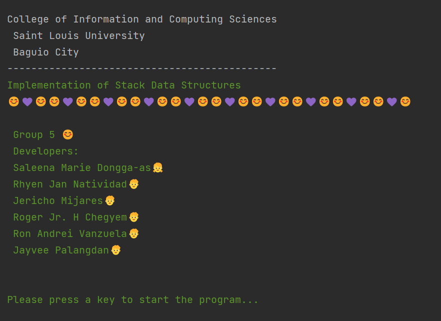
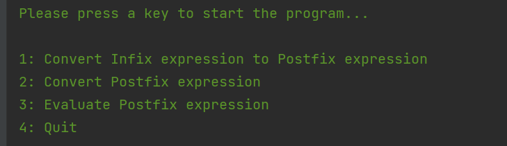
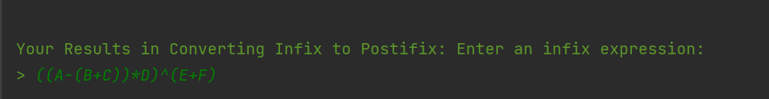
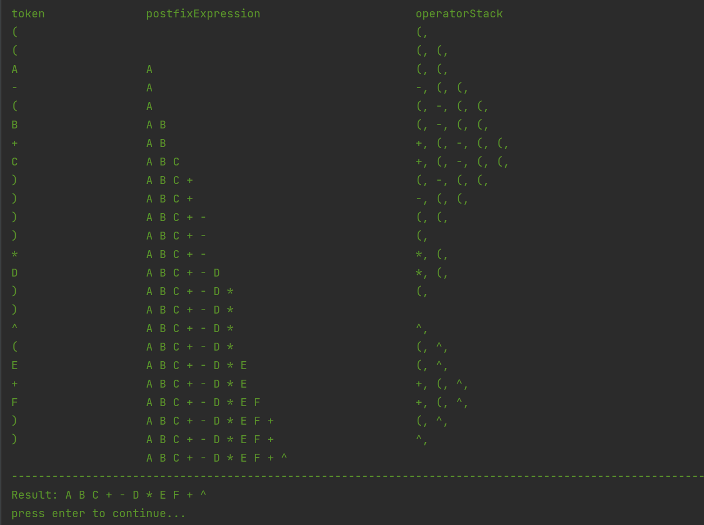
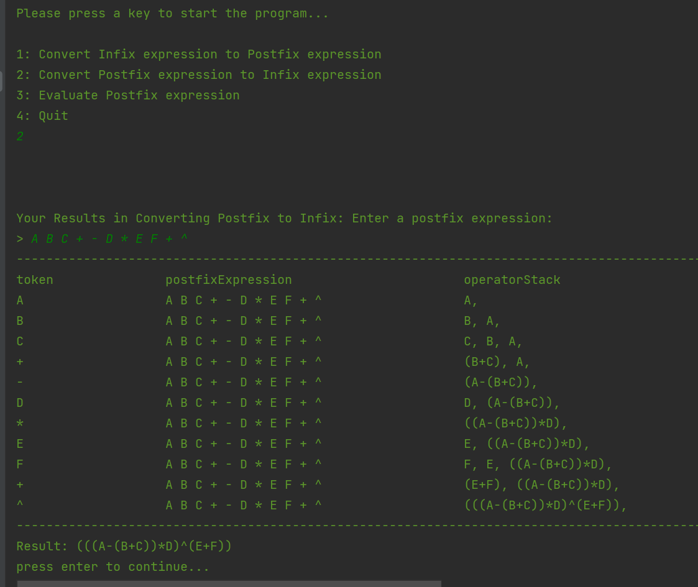
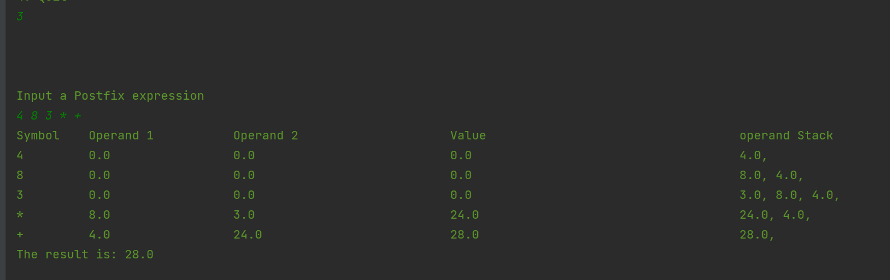
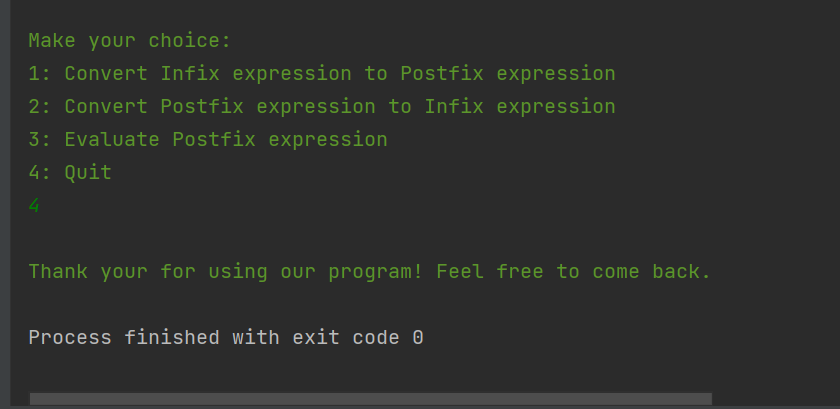

## Conversion and Evaluation of different kinds of expressions, implementation using stack
A java project to implement the data structures mainly the use of Stacks without using library
(Only generic java programming)

## User Manual
#### Starting the application
* The user must go to testerClass where the runnable class are located
* For more information about the project, you can go to the Documentation package and click README.md

#### A brief overview:
* Acknoledgement: The members in the picture all contributed to create this succesful program

* Menu of the program

* When user enter 1

* When user input 2

* When user input 3

* When user input 4

